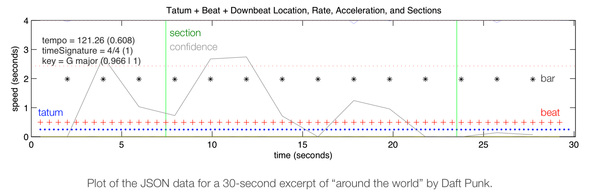

# Audio Analysis - Spotify API Documentation
> [documentation link](https://developer.spotify.com/documentation/web-api/reference/tracks/get-audio-analysis)

- [Audio Analysis - Spotify API Documentation](#audio-analysis---spotify-api-documentation)
  - [Audio Analysis Details](#audio-analysis-details)
    - [Rhythm](#rhythm)
    - [Pitch](#pitch)
    - [Timbre](#timbre)
  - [Audio Analysis Object](#audio-analysis-object)
  - [Time Interval Object](#time-interval-object)
  - [Section Object](#section-object)
  - [Segment Object](#segment-object)

## Audio Analysis Details

### Rhythm
Beats are subdivisions of bars. Tatums are subdivisions of beats. That is, bars always align with a beat and ditto tatums. Note that a low confidence does not necessarily mean the value is inaccurate. Exceptionally, a confidence of -1 indicates “no” value: the corresponding element must be discarded. A track may result with no bars, no beats, and/or no tatums if no periodicity was detected. The time signature ranges from 3 to 7 indicating time signatures of 3/4, to 7/4. A value of -1 may indicate no time signature, while a value of 1 indicates a rather complex or changing time signature. Rhythm subdivisions can be visualized in the following form:



### Pitch
Pitch content is given by a “chroma” vector, corresponding to the 12 pitch classes C, C#, D to B, with values ranging from 0 to 1 that describe the relative dominance of every pitch in the chromatic scale. For example a C Major chord would likely be represented by large values of C, E and G (i.e. classes 0, 4, and 7). Vectors are normalized to 1 by their strongest dimension, therefore noisy sounds are likely represented by values that are all close to 1, while pure tones are described by one value at 1 (the pitch) and others near 0. As can be seen below, the 12 vector indices are a combination of low-power spectrum values at their respective pitch frequencies


### Timbre
Timbre is the quality of a musical note or sound that distinguishes different types of musical instruments, or voices. It is a complex notion also referred to as sound color, texture, or tone quality, and is derived from the shape of a segment’s spectro-temporal surface, independently of pitch and loudness. The timbre feature is a vector that includes 12 unbounded values roughly centered around 0. Those values are high level abstractions of the spectral surface, ordered by degree of importance. For completeness however, the first dimension represents the average loudness of the segment; second emphasizes brightness; third is more closely correlated to the flatness of a sound; fourth to sounds with a stronger attack; etc. See an image below representing the 12 basis functions (i.e. template segments).


The actual timbre of the segment is best described as a linear combination of these 12 basis functions weighted by the coefficient values: timbre = c1 x b1 + c2 x b2 + … + c12 x b12, where c1 to c12 represent the 12 coefficients and b1 to b12 the 12 basis functions as displayed below. Timbre vectors are best used in comparison with each other.

## Audio Analysis Object

| KEY      | VALUE DESCRIPTION                                                                                                                                                                                         |
|----------|-----------------------------------------------------------------------------------------------------------------------------------------------------------------------------------------------------------|
| bars     | The time intervals of the bars throughout the track. A bar (or measure) is a segment of time defined as a given number of beats. Bar offsets also indicate downbeats, the first beat of the measure.      |
| beats    | The time intervals of beats throughout the track. A beat is the basic time unit of a piece of music; for example, each tick of a metronome. Beats are typically multiples of tatums.                      |
| sections | Sections are defined by large variations in rhythm or timbre, e.g. chorus, verse, bridge, guitar solo, etc. Each section contains its own descriptions of tempo, key, mode, time_signature, and loudness. |
| segments | Audio segments attempts to subdivide a song into many segments, with each segment containing a roughly consistent sound throughout its duration.                                                          |
| tatums   | A tatum represents the lowest regular pulse train that a listener intuitively infers from the timing of perceived musical events (segments). For more information about tatums, see Rhythm (below).       |

```json
{
  "bars": [
    {
      "start": 251.98282,
      "duration": 0.29765,
      "confidence": 0.652
    }
  ],
  "beats": [
    {
      "start": 251.98282,
      "duration": 0.29765,
      "confidence": 0.652
    }
  ],
  "sections": [
    {
      "start": 237.02356,
      "duration": 18.32542,
      "confidence": 1,
      "loudness": -20.074,
      "tempo": 98.253,
      "tempo_confidence": 0.767,
      "key": 5,
      "key_confidence": 0.327,
      "mode": 1,
      "mode_confidence": 0.566,
      "time_signature": 4,
      "time_signature_confidence": 1
    }
  ],
  "segments": [
    {
      "start": 252.15601,
      "duration": 3.19297,
      "confidence": 0.522,
      "loudness_start": -23.356,
      "loudness_max_time": 0.06971,
      "loudness_max": -18.121,
      "loudness_end": -60,
      "pitches": [
        0.709,
        0.092,
        ...
      ],
      "timbre": [
        23.312,
        -7.374,
        -45.719,
        294.874,
        ...
      ]
    }
  ],
  "tatums": [
    {
      "start": 251.98282,
      "duration": 0.29765,
      "confidence": 0.652
    }
  ],
  "track": {
    "duration": 255.34898,
    "sample_md5": "",
    "analysis_sample_rate": 22050,
    "analysis_channels": 1,
    "loudness": -11.84,
    "tempo": 98.002,
    "tempo_confidence": 0.423,
    "time_signature": 4,
    "time_signature_confidence": 1,
    "key": 5,
    "key_confidence": 0.36,
    ...
  }
}
```

## Time Interval Object

| KEY        | VALUE DESCRIPTION                                                    |
|------------|----------------------------------------------------------------------|
| start      | The starting point (in seconds) of the time interval.                |
| duration   | The duration (in seconds) of the time interval.                      |
| confidence | The confidence, from 0.0 to 1.0, of the reliability of the interval. |

## Section Object

| KEY        | VALUE DESCRIPTION                                                    |
|------------|----------------------------------------------------------------------|
| start      | The starting point (in seconds) of the time interval.                |
| duration   | The duration (in seconds) of the time interval.                      |
| confidence | The confidence, from 0.0 to 1.0, of the reliability of the interval. |

## Segment Object

| KEY               | VALUE DESCRIPTION                                                                                                                                                                                                                                                                                     |
|-------------------|-------------------------------------------------------------------------------------------------------------------------------------------------------------------------------------------------------------------------------------------------------------------------------------------------------|
| start             | The starting point (in seconds) of the segment.                                                                                                                                                                                                                                                       |
| duration          | The duration (in seconds) of the segment.                                                                                                                                                                                                                                                             |
| confidence        | The confidence, from 0.0 to 1.0, of the reliability of the segmentation. Segments of the song which are difficult to logically segment (e.g: noise) may correspond to low values in this field.                                                                                                       |
| loudness_start    | The onset loudness of the segment in decibels (dB). Combined with loudness_max and loudness_max_time, these components can be used to describe the “attack” of the segment.                                                                                                                           |
| loudness_max      | The peak loudness of the segment in decibels (dB). Combined with loudness_start and loudness_max_time, these components can be used to describe the “attack” of the segment.                                                                                                                          |
| loudness_max_time | The segment-relative offset of the segment peak loudness in seconds. Combined with loudness_start and loudness_max, these components can be used to describe the “attack” of the segment.                                                                                                             |
| loudness_end      | The offset loudness of the segment in decibels (dB). This value should be equivalent to the loudness_start of the following segment.                                                                                                                                                                  |
| pitches           | A “chroma” vector representing the pitch content of the segment, corresponding to the 12 pitch classes C, C#, D to B, with values ranging from 0 to 1 that describe the relative dominance of every pitch in the chromatic scale. More details about how to interpret this vector can be found below. |
| timbre            | Timbre is the quality of a musical note or sound that distinguishes different types of musical instruments, or voices. Timbre vectors are best used in comparison with each other. More details about how to interpret this vector can be found on the below.                                         |